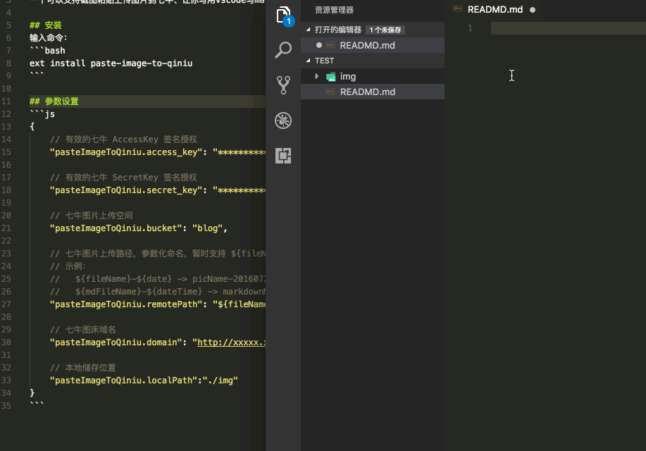

# vscode-paste-image-to-qiniu

一个可以支持截图粘贴上传图片到阿里云、让你写用vscode写markdown有更好的体验。



## 安装
输入命令：
```bash
ext install paste-image-to-aliyun
```
或者在插件应用商店搜索paste-image-to-aliyun安装

## 参数设置
```js
{
    "pasteImageToAliyun.fetchTokenUrl": "",
    "pasteImageToAliyun.endpoint": "",
    "pasteImageToAliyun.bucket": "",
    "pasteImageToAliyun.localPath": "",
    "pasteImageToAliyun.remotePath": ""
}
```

一直使用vscode来开发、写笔记文章、但是用了几款vscode的图床插件都不是很符合我的需求。今天本来想看看书写点笔记、但是发现截图了去处理图片太过于麻烦、于是有了这个插件、仅仅是想体验一下vscode插件的开发流程、也可以方便自己的写体验。

将[vscode-paste-image](https://github.com/mushanshitiancai/vscode-paste-image)和[vscode-qiniu-upload-image](https://github.com/yscoder/vscode-qiniu-upload-image)综合改成了现在这个插件。


如果用的开心给个star也不错！